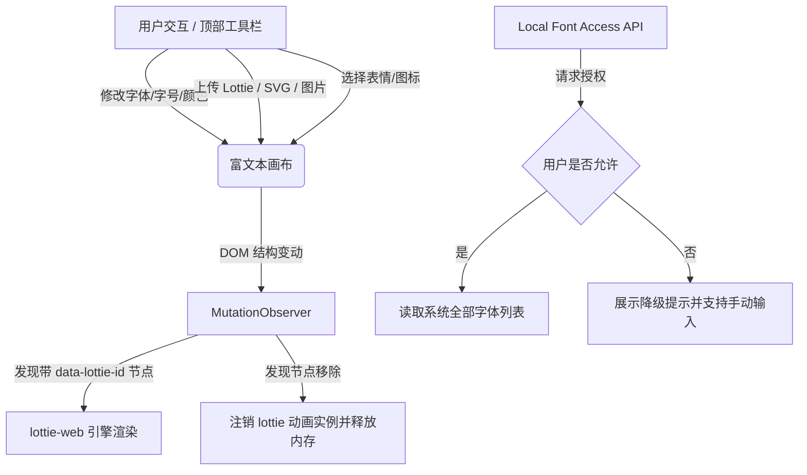

# Moonvy·Text 产品设计与需求文档 (PRD)

## 1. 项目概述

### 1.1 项目背景与定位
**Moonvy·Text**（中文名：文字编辑与预览工具）是一款轻量、极简且美观的网页富文本排版与视觉设计工具。它旨在打破传统富文本编辑器（如 Word、Markdown 编辑器）与视觉设计软件（如 Photoshop、Figma）之间的壁垒，为自媒体创作者、运营人员、设计师等提供一个“所见即所得”的文字排版与视觉预览画布。

用户可以在画布中自由组合精美的 Google 字体、系统本地字体，并混排动态 Fluent 表情、矢量图标、GIF 动图以及 Lottie 轻量级动效，一键调色，快速生成极具视觉吸引力的图文排版。

### 1.2 核心价值
- **极简而美观**：暗黑科技感界面，操作直观。
- **混合媒介排版**：支持文字与动态 Emoji、Lucide 图标、SVG、Lottie 动效的高效混排。
- **字体自由度**：无缝调用 Google 线上字体，同时支持 Local Font Access API 读取本地已安装的专业字体。
- **无感渲染**：全动态的 MutationObserver 机制，在用户编辑过程中实时激活 Lottie 和 SVG 动画。

---

## 2. 产品功能架构与需求

### 2.1 核心画布编辑器 (Canvas Editor)
- **ContentEditable 容器**：采用原生的 `contentEditable` 实现，支持撤销/重做（Ctrl+Z / Ctrl+Y）的系统历史记录栈。
- **占位符设计**：当画布完全空白且失去焦点时，展示人性化的提示词（Placeholder）引导输入。
- **全局与局部样式切换**：
  - 在未选中文字时，调节字体、字号、行高和对齐方式将应用于全局画布。
  - 在有文字选中的情况下，使用 `document.execCommand` 将样式精确应用到当前选区。

### 2.2 字体管理系统 (Font Manager)
系统提供三大字体来源通道，满足多场景的排版诉求：
1. **Google 字体库**：
   - 预设精选的艺术、手写、无衬线与衬线字体（如 Anton, Pacifico, Playfair Display 等）。
   - 支持动态创建 `<link>` 标签，按需预加载字体文件，保障画布文字在切换时无闪烁过渡。
   - 提供按分类筛选（Display, Handwriting, Script, Sans, Serif, Pixel）和关键词检索功能。
2. **系统本地字体**：
   - 采用现代浏览器提供的 `Local Font Access API` (`window.queryLocalFonts`)，在获得用户授权后读取操作系统本地安装的所有专业字体。
   - 针对不支持该 API 的浏览器或 iframe 嵌入环境，提供完整的错误降级处理机制（Denied、Blocked、Unsupported 等状态提示），并引导用户重试或在独立标签页打开。
   - 内置“常用系统字体”快捷预选面板（如 苹方、微软雅黑、Helvetica Neue、Arial 等）。
3. **手动输入字体**：
   - 提供输入框，允许用户直接输入任意本地字体名称进行应用，确保在 API 失败时仍有灵活的保底方案。

### 2.3 颜色设计系统 (Color Palette)
- 采用微前端/Web Component 组件 `<pretty-color-picker>` 作为取色器。
- 支持调色板 Popover 悬浮浮层，不占用宝贵的编辑区空间。
- **双色配置**：
  - **字体颜色 (Text Color)**：支持设置选中文本或全局文本的前景色。
  - **画布背景色 (Canvas Background)**：支持更换画布背景色，便于预览在深色或亮色背景下的文字排版效果。

### 2.4 媒介素材嵌入系统 (Media Insertion)
1. **Native 系统表情包**：
   - 按 Smiles、Hearts、Magic、Animals、Food、Fun 等分类组织的系统原生字符表情，支持通过快捷面板直接插入光标处。
2. **微软 Fluent 3D 表情包**：
   - 精选微软 Fluent 3D 动画表情（通过 jsDelivr CDN 动态加载高品质 APNG/PNG 动图）。
   - 提供完整的 CDN 图片加载失败降级方案：若图片加载失败，自动替换为对应的 Native 系统 Emoji 字符，保障画布内容不残缺。
3. **Lucide 矢量图标库**：
   - 内置高频使用的精美 Lucide 图标，支持关键字快速搜索。
   - 插入时光标处将直接嵌入 inline 形式的 SVG 图标，支持与文字一样随字号大小（fontSize）及文字颜色（foreColor）自动缩放与变色。
4. **多媒体文件上传**：
   - 支持上传静态图（PNG, JPG）、原生动图（GIF, APNG, WebP）直接作为行内元素混排。
   - 支持上传 SVG 矢量图，通过 `FileReader` 读取并将其作为 inline SVG 插入，保留 SVG 内部自带的 CSS 动画或 SMIL 轨迹动画。
   - 支持上传 **Lottie JSON 动画**，在插入时转化为带 `data-lottie-id` 的容器。

---

## 3. 技术实现方案

### 3.1 核心富文本技术
- **选区保持 (Selection Preservation)**：
  为了避免用户在顶部工具栏操作或弹窗交互时丢失光标位置，系统通过 `selectionchange` 监听器实时在内存中克隆并保存当前的 `Range` 对象 (`savedRangeRef.current`)。在执行插入操作前，先通过 `restoreSavedRange` 重新激活选区，确保插入的内容（如图片、表情、SVG 等）精准落在用户期望的光标位置。
- **优雅插入与光标定位**：
  使用 `document.execCommand("insertHTML")` 插入行内元素时，Chrome 浏览器通常会为 Void Element 自动追加额外的 ` ` 换行符以确保光标有生存空间。系统在插入时会动态追随一个临时的 `anchor` 标记，插入完成后在 `requestAnimationFrame` 微任务中自动剪枝掉多余 of ` ` 换行符，并将光标无感地重置到所插媒介的紧后方。

### 3.2 Lottie 运行时激活与内存管理
由于 `contentEditable` 编辑器支持撤销（Ctrl+Z）、粘贴和随意删除，直接在画布中操作包含复杂 JavaScript 实例化动画的容器会导致动画状态丢失或内存泄漏。
Moonvy·Text 通过全局 **`MutationObserver`** 对画布的子树变动进行实时监控：
- **节点新增**：当监听到新增节点（或已有节点的子树中）含有 `data-lottie-id` 属性时，从内存的 `lottieDataRef` 中提取对应的 JSON 动画数据，调用 `lottie-web` 的 `loadAnimation` 方法进行 SVG 渲染，并将动画实例存入 `lottieInstancesRef` 中，保持循环播放。
- **节点移除**：当监听到对应节点被删除时，立即调用其动画实例的 `destroy()` 方法释放 CPU 和内存，并同步清理内存引用，防止多次操作后页面卡顿。

---

## 4. 交互与键盘快捷键规范

为了向设计师和专业编辑提供流畅的操作体验，工具完全适配了系统级快捷键：

| 快捷键 | 功能 | 备注 |
| :--- | :--- | :--- |
| **Command/Ctrl + Z** | 撤销 (Undo) | 原生撤销栈，支持文本和媒体的删除回退 |
| **Command/Ctrl + Shift + Z** | 重做 (Redo) | 重新执行已被撤销的操作 |
| **Command/Ctrl + Y** | 重做 (Redo) | Windows 习惯的重做键位 |
| **Command/Ctrl + B** | 加粗 (Bold) | 对选中文字应用加粗效果 |
| **Command/Ctrl + I** | 斜体 (Italic) | 对选中文字应用斜体效果 |
| **Command/Ctrl + A** | 全选 (Select All) | 全选画布中的所有内容 |

底部常驻快捷键提示条，方便用户快速上手。

---

## 5. 产品未来规划 (Roadmap)

### 5.1 导出与分享增强
- **高保真图片导出**：集成 `html2canvas` 或 `dom-to-image`，支持用户将排版好的画布一键导出为 PNG/JPG 高清长图，自动适配视网膜屏幕（Retina Display）。
- **SVG / 动画打包导出**：支持将排版好的内容导出为包含 Base64 媒体的独立 HTML 文件，保持动效的完整生命力，方便作为网页卡片分享。

### 5.2 协作与云端草稿箱
- **云端存储**：提供用户登录体系，支持将画布排版草稿同步保存至云端。
- **多端同步**：适配移动端阅读预览，支持生成短链接，方便在微信、微博等移动端直接扫描预览排版效果。

### 5.3 丰富的设计模版库
- 内置针对社交媒体海报、公众号配图、动态文字卡片等的精美排版模版，用户可一键套用，快速修改文字及动效。
